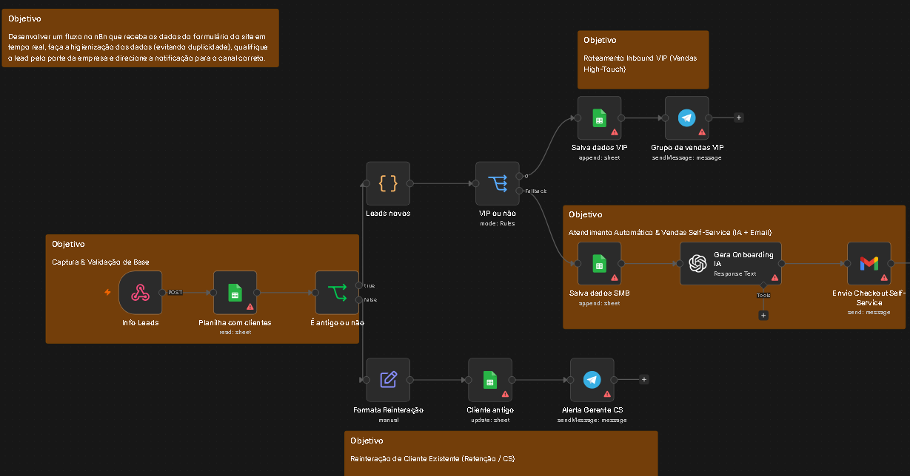

# 🚀 Estudo de Caso: Automação de Inbound Sales B2B com Qualificação por IA e Deduplicação

## 📋 Descrição do Projeto
A **TechFlow B2B** (empresa de software SaaS) enfrentava dois grandes gargalos operacionais no seu processo comercial:
1. **Perda de tempo da equipe de vendas** qualificando manualmente pequenos leads versus grandes contas.
2. **Duplicidade de cadastros** no banco de dados quando clientes existentes preenchiam o formulário do site pedindo novo contato.

## 🛠️ Solução Desenvolvida
Desenvolvimento de um fluxo orquestrado no **n8n** que recebe as submissões em tempo real via Webhook, realiza a checagem de duplicidade na base de dados, aplica roteamento inteligente baseado no porte da empresa e automatiza a venda de pequenos contratos utilizando Inteligência Artificial (OpenAI).

---

## 📐 Arquitetura do Fluxo

### 🔄 Lógica de Funcionamento:

1. **Captura & Deduplicação:**
   - O nó `Info Leads` (Webhook) recebe a submissão do site em tempo real.
   - O nó `Planilha com clientes` realiza a busca por e-mail na base existente.
   - O nó `É antigo ou não` (If) desvia o fluxo:
     - **Se o cliente já existir:** Formata a data de reinteração (`Formata Reinteração`), atualiza o histórico na planilha (`Cliente antigo`) e dispara um alerta privado no Telegram para o Gerente de Sucesso do Cliente (`Alerta Gerente CS`), evitando spam na equipe de vendas.
     - **Se for um lead novo:** Direciona para o nó de higienização e sanitização de dados (`Leads novos`).

2. **Qualificação & Roteamento (`VIP ou não` - Switch):**
   - **Leads VIP (>= 50 funcionários):** Registro na aba VIP (`Salva dados VIP`) e notificação urgente no Telegram para a equipe de vendas humana agir imediatamente (`Grupo de vendas VIP`).
   - **Leads SMB (< 50 funcionários):** Registro na aba SMB (`Salva dados SMB`), envio do contexto para o nó da OpenAI (`Gera Onboarding IA`) para criar uma mensagem personalizada de vendas e disparo automático de e-mail com link de checkout self-service (`Envio Checkout Self-Service`).

---

## 🧰 Tecnologias e Nós Utilizados
- **Orquestrador:** n8n
- **Integrações:** Google Sheets API, Telegram Bot API, Gmail API, OpenAI API
- **Nós de Lógica:** Webhook, Code Node (JavaScript), Switch, If Node, Edit Fields
