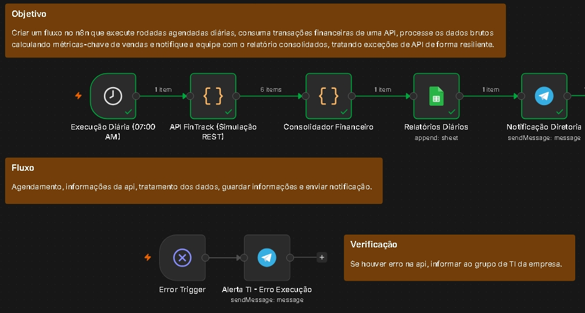

# 📊 Estudo de Caso: Consolidação Financeira Automatizada via API REST e Error Handling Resiliente

## 📋 Descrição do Projeto
A **FinTrack SaaS** necessitava de uma solução automatizada para consolidar diariamente as transações de vendas processadas pelo gateway de pagamentos. O processo anterior exigia intervenção manual para extração de relatórios, cálculos de métricas de desempenho (faturamento, taxa de aprovação e tíquete médio) e comunicação com a diretoria.

## 🛠️ Solução Desenvolvida
Desenvolvimento de um pipeline de dados agendado no **n8n** que consome dados brutos de uma API REST, agrega e calcula métricas em tempo de execução via **JavaScript (`Code Node`)**, registra os relatórios consolidados em planilha e notifica os stakeholders via Telegram. O fluxo conta com um **mecanismo de Error Trigger** para alerta imediato da equipe de TI em caso de indisponibilidade de serviços.

---

## 📐 Arquitetura do Fluxo

### 🔄 Lógica de Funcionamento:

1. **Agendamento & Consumo de Dados (`Fluxo Principal`):**
   - **Gatilho Agendado (Cron):** Disparo automático diário nos horários pré-configurados de fechamento de turno.
   - **API FinTrack (HTTP Request):** Requisição GET para buscar o payload JSON contendo as transações brutas do dia anterior.
   - **Consolidador Financeiro (Code Node):** Algoritmo em JavaScript que processa o array de dados:
     - Filtra transações aprovadas e recusadas.
     - Sumariza o faturamento total (R$).
     - Calcula a taxa de aprovação (%) e o tíquete médio (R$).
   - **Relatórios Diários (Google Sheets):** Gravação histórica das métricas calculadas.
   - **Notificação Diretoria (Telegram):** Envio da mensagem formatada com o resumo do desempenho financeiro.

2. **Gestão de Falhas & Resiliência (`Verificação / Error Handling`):**
   - **Error Trigger:** Monitora exceções não tratadas e falhas de conexão na API HTTP.
   - **Alerta TI - Erro Execução (Telegram):** Dispara notificação imediata com timestamp e detalhes da falha para o canal de engenharia/TI.

---

## 🧰 Tecnologias e Nós Utilizados
- **Orquestrador:** n8n
- **Consumo de Dados:** HTTP Request (API REST / JSON)
- **Transformação de Dados:** Code Node (JavaScript / Array Manipulation)
- **Comunicação & Armazenamento:** Google Sheets API, Telegram Bot API
- **Gestão de Exceções:** Error Trigger Node
