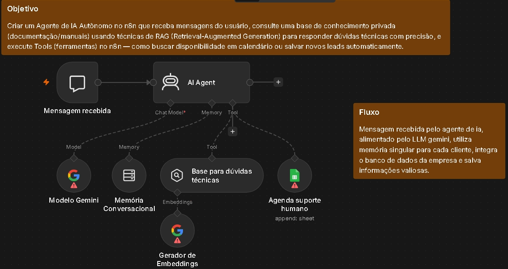

# 🤖 Estudo de Caso: Agente Autônomo de IA com RAG e Execução de Ferramentas (Suporte & Agendamento)

## 📋 Descrição do Projeto
A **AutoSupport AI** enfrentava gargalos no atendimento de Suporte Nível 1 devido ao alto volume de dúvidas técnicas repetitivas sobre documentações de produtos e à demora no agendamento manual de reuniões/suporte especializado.

## 🛠️ Solução Desenvolvida
Construção de um **Agente Conversacional Autônomo de IA** orquestrado no **n8n** utilizando o ecossistema LangChain. O agente é capaz de manter histórico e contexto de conversa (Memória), realizar consultas precisas em base de conhecimento privada através de **RAG (Retrieval-Augmented Generation)** sem alucinações, e executar **Tools (Ferramentas)** em tempo real para registro de dados e agendamentos.

---

## 📐 Arquitetura do Fluxo

### 🔄 Lógica de Funcionamento:

1. **Recepção de Mensagem (`Mensagem recebida`):**
   - Recebe a mensagem do cliente via chat/webhook acompanhada pelo ID de sessão único.

2. **Cérebro e Memória do Agente (`AI Agent`):**
   - **Modelo LLM (`Modelo Gemini`):** Atua como o motor de raciocínio lógico do agente.
   - **Memória Conversacional:** Armazena o histórico do diálogo para interações fluida e contextuais por cliente.

3. **Recuperação de Informação e Ação (`Tools`):**
   - **Base para dúvidas técnicas (RAG / Vector Store):** Recupera trechos dos manuais de produtos convertidos via *Embeddings* para responder dúvidas com máxima precisão técnica.
   - **Agenda suporte humano (Tool / Google Sheets):** Executada autonomamente pelo agente quando detecta a intenção do cliente de agendar um atendimento técnico ou falar com um especialista.

---

## 🧰 Tecnologias e Nós Utilizados
- **Orquestrador & IA:** n8n (LangChain AI Agent, Chat Trigger)
- **Modelos de Linguagem:** Google Gemini LLM / Embeddings
- **Técnicas de IA:** RAG (Retrieval-Augmented Generation), Memory Buffer, Tool Calling
- **Integrações de Destino:** Google Sheets API / Vector Store
